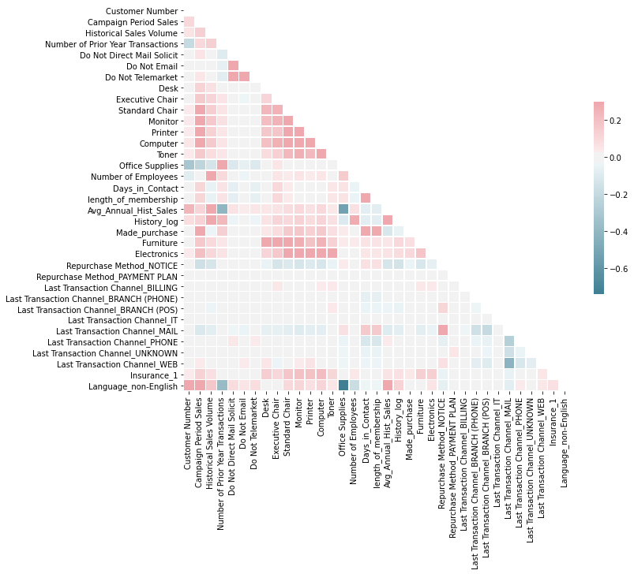
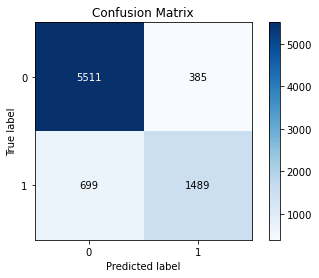

# PROJECT - OFFICE SUPPLIER - LEADS FEEDBACK
---

**Context**: 

An office supply store tests a telemarketing campaign to its existing business customers. The company targeted approximately 16,000 customers for the campaign.

**Project objectives**:

Profile the customers that responded to the campaign to make the company aware of who its typical customer is.
Develop models that will allow the company to use the results of the campaign to target future, similar campaigns.
Show the financial value of your models. 

# Code and Resources
---                               
**Python Version**: 3.7

**Package**: pandas, numpy, matplotlib, LinearRegression, Lasso, ElasticNet, DecisionTreeRegressor,KNeighborsRegressor
GradientBoostingRegressor,RandomForestRegressor, Pipeline, StandardScaler,KFold

# Data

- Customer Number
- Campaign Period Sales 	 
- Historical Sales Volume 	
- Date of First Purchase	
- Number of Prior Year Transactions	
- Do Not Direct Mail Solicit	
- Do Not Email	
- Do Not Telemarket	
- Repurchase Method	
- Last Transaction Channel	
- Desk	
- Executive Chair	
- Standard Chair	
- Monitor	
- Printer	
- Computer	
- Insurance	
- Toner	
- Office Supplies	
- Number of Employees	
- Language

# EDA

# Model Development
---
Dummied all categoriacal variables after some feature engineering.

50/50 Test size split

**Classification to predict purchase:**

Used Grid Search to attain the best params after scaling

**Results:**

**Regression:**

Created Pipelines for the following for Neg mean squared error:

- ScaledLR: -248688.862179 (44213.922746)
- ScaledLASSO: -248475.771013 (44079.382808)
- ScaledEN: -268812.702054 (52685.020150)
- ScaledKNN: -240980.742861 (34378.570938)
- ScaledCART: -93450.752264 (34049.827022)
- ScaledGBM: -60184.298000 (11344.351406)
- ScaledRFR: -58258.519118 (15000.863965)

